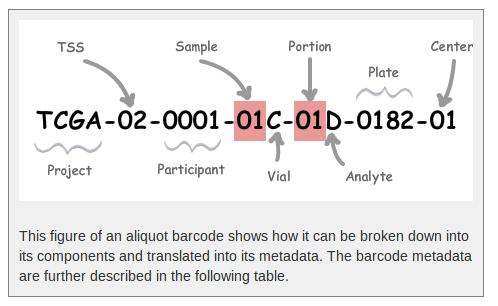

# pyflow-ChIPseq
a snakemake pipeline to process ChIP-seq files from GEO

I have so many people asking me to process a public GEO ChIP-seq data set for them. I hate to repeat the same steps and decide to make a pipeline for it.

switch to a different branch to see the codes. now I have `shark` branch for the LSF system.

**UPDATE** 05/30/2017. Now, the pipeline can handle in-house data as well.

Now, this is working on LSF, I will have another branch for Moab.

### Citation

I created a doi on [zenodo](https://zenodo.org/).  
You can cite:

[](https://zenodo.org/badge/latestdoi/89386223)

### work flow of the pipeline


In the `config.yaml` file you can change settings. e.g. path to a different genome to align, p value cut-offs. The `target_reads` is the number of reads that downsampled to. I set 15 million for default. If the number of reads of the orignal bam files are less than `target_reads`, the pipeline will just keep whatever the number it has.

### Dependiencies

* [snakemake](https://bitbucket.org/snakemake/snakemake). snakemake is python3
* R > 3.3.0
you will need `optparse` package. `install.packages("optparse")`
`SRAdb`

```r
source("https://bioconductor.org/biocLite.R")
biocLite("SRAdb")
```

```
 Rscript sraDownload.R  -a ascp -QT -l 300m -i ~/.aspera/connect/etc/asperaweb_id_dsa.openssh -t fastq SRR3144652
```

This script will download the meta file for each SRR id as well.

* aspera for downloading

check this blog post by MARK ZIEMANN http://genomespot.blogspot.com/2015/05/download-sra-data-with-aspera-command.html

```bash
sh <(curl -s aspera-connect-3.6.2.117442-linux-64.sh)
```

`sraDownload.R` is under the `scripts` folder from [Luke Zappia](https://github.com/lazappi):

```bash
## single quote your ascp command, otherwise R will be confused
Rscript sraDownload.R  -a 'ascp -QT -l 300m -i ~/.aspera/connect/etc/asperaweb_id_dsa.openssh' -t fastq SRR3144652

```

* [fastqc](https://www.bioinformatics.babraham.ac.uk/projects/fastqc/)
* `bamCoverage` v2.3.3 from [deeptools](https://github.com/fidelram/deepTools) for making RPKM normalized and input subtracted bigwig files
* [bowtie1](http://bowtie-bio.sourceforge.net/index.shtml) for aligning short reads (< 50bp)
* [samblaster](https://github.com/GregoryFaust/samblaster) v0.1.22 to remove duplicates and downsampling.
* [samtools](http://www.htslib.org/) v1.3.1
* [ROSE](http://younglab.wi.mit.edu/super_enhancer_code.html) for calling superEnhancer. ROSE has to be run inside the installation folder. now I hard coded the path in the Snakefile. (you will have to change that to the ROSE directory in your cluster). Todo: expose the path to the `config.yaml` file that one can change.
* [macs1](https://pypi.python.org/pypi/MACS/1.4.2) v1.4.2 and [macs2](https://github.com/taoliu/MACS) v2.1.1 for calling peaks (macs2 for broad peaks).
* [multiQC](http://multiqc.info/)
* [phantompeakqual](https://github.com/kundajelab/phantompeakqualtools)


`macs1`, `macs2` and `ROSE` are python2.x, see this [Using Snakemake and Macs2](https://groups.google.com/forum/#!searchin/snakemake/macs%7Csort:relevance/snakemake/60txGSq81zE/NzCUTdJ_AQAJ) in the snakemake google group.

if you look inside the `Snakefile`, I did `source activate root` back to python2.x before running macs1 and macs2.

There will be [Integration of conda package management into Snakemake](https://bitbucket.org/snakemake/snakemake/pull-requests/92/wip-integration-of-conda-package/diff)


### How to distribute workflows

read [doc](https://snakemake.readthedocs.io/en/stable/snakefiles/deployment.html)

```bash
ssh shark.mdanderson.org

# start a screen session
screen

# make a folder, name it yourself, I named it workdir for demon
mkdir /rsch2/genomic_med/krai/workdir/

cd /rsch2/genomic_med/krai/workdir/

git clone https://github.com/crazyhottommy/pyflow-ChIPseq

cd pyflow-ChIPseq

## go to downsampling branch. shark is LSF system
git checkout shark

## edit the config.yaml file as needed, e.g. set mouse or human for ref genome, p value cut off for peak calling, the number of reads you want to downsample to
nano config.yaml

## skip this if on Shark, samir has py351 set up for you. see below STEPS
conda create -n snakemake python=3 -c bioconda multiqc snakemake deeptools
source activate snakemake
```

## STEPS for fastq files from GEO

### Download the sra files

Prepare a txt file `SRR.txt` which has three columns: sample_name, fastq_name, and factor:

e.g.

```bash
cat SRR.txt

sample_name fastq_name  factor 
MOLM-14_DMSO1_5 SRR2518123   BRD4     
MOLM-14_DMSO1_5 SRR2518124  Input
MOLM-14_DMSO2_6 SRR2518125  BRD4
MOLM-14_DMSO2_6 SRR2518126  Input


```

You can have mulitple different factors for the same sample_name.  

`sample_name_factor` will be used to name the output. e.g. :`MOLM-14_DMSO1_5_BRD4.sorted.bam`

### download the sra files using the R script

```bash
cd pyflow-ChIPseq
mkdir fastqs
cd fastqs
## fastq-dump only convert the sra files to fastq to the current folderr
```

make a shell script:
`download.sh`

download the sqlite database from http://dl.dropbox.com/u/51653511/SRAmetadb.sqlite.gz and unzip it. place it in the `scripts` folder
```bash
# /bin/bash
set -euo pipefail

## you will need to change the ascp command to get the right path
Rscript ../scripts/sraDownload.R -a 'ascp -QT -l 300m -i ~/.aspera/connect/etc/asperaweb_id_dsa.openssh' -d ../scripts/SRAmetadb.sqlite $1
```

`chmod u+x download.sh`

```bash
# inside the pyflow-ChIPseq/fastq folder:
cat ../SRR.txt | sed '1d' | cut-f2 | sort | uniq > srr_unique.txt

## only have 4 jobs in parallel, good behavior on a cluster
cat srr_unique.txt | parallel -j 4 ./download.sh {}

# all the sra files will be downloaded in the current fastqs folder.
```

Now you have all `sra` files downloaded into `fastqs` folder, proceed below:

### convert `sra` to `fastqs` and compress to .gz files 

```bash

## you can use a for loop to fastq-dump the downloaded sra files.
find *sra| parallel -j 4  fastq-dump {}

find *fastq | parallel -j 4  bgzip {}

## save some space
rm *sra

# go gack to the pyflow-ChIPseq folder
cd ..

python3 sample2json.py --fastq_dir fastqs/ --meta SRR.txt 
```

A `samples.json` file will be created and some information will be printed out on the screen.

### start the pipeline

```bash
## dry run
snakemake -np

## test for one sample
./pyflow-ChIPseq.sh  07bigwig/SRR2518123.bw

```

if no errors, preceed below.

### Using [DRMAA](https://www.drmaa.org/)

[job control through drmaa](http://drmaa-python.readthedocs.io/en/latest/tutorials.html#controlling-a-job)

DRMAA is only supported on `Shark` (LSF system).

```bash
module load drmma
./pyflow-drmaa-ChIPseq.sh
```

Using `drmaa` can `control + c` to stop the current run.

Dependent jobs are submitted one by one, if some jobs failed, the pipeline will stop. Good for initital testing.

### submit all jobs to the cluster

```bash
./pyflow-ChIPseq.sh 
```

All jobs will be submitted to the cluster on queue.  This is useful if you know your jobs will succeed for most of them and the jobs are on queue to gain priority.

## process the custom data produced from the sequencing core.

Different People have different naming conventions, to accomondate this situation, I require them to give me a `meta.txt` tab delimited file to have the sample information.

The `sample2json.py` script assumes that the fastq_name in the `meta.txt` file exist in the fastq files. Only the first three columns will be used.
`factor`s from the same `sample_name` will be made into one group.

set the `control` which you are going to use for peak calling. e.g. Input, IgG


```bash
cd pyflow-ChIPseq
cat meta.txt
sample_name     fastq_name      factor  reference
sample1 Li-Lane-1-1A-062817     CST-CHD1        mouse
sample1 Li-Lane-1-1C-062817     Bethal-CHD1     mouse
sample1 Li-Lane-1-1E-062817     IgG     mouse
sample1 Li-Lane-4-7E-062817     Input   mouse
sample2 Li-Lane-1-1B-062817     CST-CHD1        mouse
sample2 Li-Lane-1-1D-062817     Bethal-CHD1     mouse
sample2 Li-Lane-1-1F-062817     IgG     mouse
sample2 Li-Lane-4-7F-062817     Input   mouse
sample3 Li-Lane-2-3C-062817     SOX2    mouse
sample3 Li-Lane-2-3D-062817     H3K27Ac mouse
sample3 Li-Lane-4-7G-062817     Input   mouse
sample4 Li-Lane-2-3E-062817     H3K9me3 mouse
sample4 Li-Lane-3-5A-062817     H3K27Ac mouse
sample4 Li-Lane-3-5E-062817     MYC     mouse
sample4 Li-Lane-2-7H-062817     Input   mouse
sample5 Li-Lane-2-3F-062817     H3K9me3 mouse
sample5 Li-Lane-3-5B-062817     H3K27Ac mouse
sample5 Li-Lane-3-9A-062817     Input   mouse
sample6 Li-Lane-2-3G-062817     H3K9me3 mouse
sample6 Li-Lane-3-5C-062817     H3K27Ac mouse
sample6 Li-Lane-4-9B-062817     Input   mouse
sample7 Li-Lane-2-3H-062817     H3K9me3 mouse
sample7 Li-Lane-3-5D-062817     H3K27Ac mouse
sample7 Li-Lane-3-5H-062817     MYC     mouse
sample7 Li-Lane-4-9C-062817     Input   mouse


## only the first 2 columns are required.

## make a samples.json file
python3 sample2json.py --fastq_dir dir/to/fastqs/ --meta meta.txt 
```

The real name of the fastq files:  

`/rsrch2/genomic_med/krai/zheng-ChIPseq-2/Sample_Li-Lane-1-1C-062817/Li-Lane-1-1C-062817_S24_L004_R1_001.fastq.gz`    

check the example `samples.json` file in the repo.

Now, the same as the steps as processing the `sra` files

```bash
# dry run
pyflow-ChIPseq.sh  -np 
```


### Extra notes on file names
If one sets up a lab, it is necessary to have consistent file naming across all the projects. `TCGA`project is a great example for us to follow. A [barcode system](https://wiki.nci.nih.gov/display/TCGA/TCGA+barcode) can make your life a lot easier for downstream analysis.



Similarily, for a ChIP-seq project, it is important to have consistent naming.
In Dr.Kunal Rai'lab. We adopted a barcoding system similar to TCGA:

e.g.
`TCGA-SKCM-M028-11-P008-A-NC-CJT-T`

`TCGA` is the big project name;  
`SKCM` is the tumor name;
`M028` is the sample name (this should be an unique identifier);  
`11` is the sequencing tag;
we use `11` to denote first time IP, first time sequencing, if the reads number is too few, but the IP worked, we just need to resequence the same library. for the resequencing sample, we will use `12` for this. if the total reads number is still too low, `13` could be used. `21` will be second time IP and first time sequencing. etc.  
`P008` is the plate number of that IP experiment, we now use 96-well plate for ChIP-seq, we use this id to track which plate the samples are from.  
`A` is the chromatin mark name or transcription factor name. we have a naming map for this:  
`A` is H3K4me1, `B` is H3K9me3 and `G` is for Input etc.  

The other barcode areas can be used for other information. `NC` means the samples were sequenced in north campus.

It saves me a lot in the downstream processing. The barcode can be captured by a universal regular expression from the fastq.gz files.

A real experiment comes a fastq.gz name like this 

`TCGA-SKCM-M028-R1-P008-C-NC-CJT-T_TTAGGC_L001_R1_006.fastq.gz`  

multiplexing is very common nowadays, the sequencing reads for the same sample may come from different lanes, after de-multiplexing, multiple files for the same sample will be put in the same folder. If you name your files in a consistent way, you can easily merge all the fastq files before mapping. (for DNA sequencing, it is recommended to map the fastq files independently and then merge the mapped bam files with read-group to identify which lane it is from).

It also helps for merging the fastq files from two different rounds of sequencing. I know sequencing tag `11` and `12` with the same sample name and chromatin mark name are for the same sample, so I can merge them together programatically.

I also know that `G` is a Input control sample, I can then call peaks, make Input subtracted bigwigs etc using a IP vs Input pattern. (A_vs_G, B_vs_G). Same idea can be used for `tumor` and `control` for whole genome sequencing when calling mutations and copynumber.

Many other people out of our lab let me process their data, I can not enforce naming of the files before they carry out the experiments. That's why I require them to give me a `meta.txt` file instead.

### job control

To kill all of your pending jobs you can use the command:

```bash
bkill `bjobs -u krai |grep PEND |cut -f1 -d" "`
```

other useful commands: 

```
bjobs -pl
Display detailed information of all pending jobs of the invoker.

bjobs -ps
Display only pending and suspended jobs.

bjobs -u all -a
Display all jobs of all users.

bjobs -d -q short -m apple -u mtang1
Display all the recently finished jobs submitted by john to the
queue short, and executed on the host apple.
```

### rerun some of the jobs

```bash

# specify the name of the rule, all files that associated with that rule will be rerun. e.g. rerun macs2 calling peaks rule,
./pyflow-ChIPseq -R call_peaks_macs2

## rerun one sample, just specify the name of the target file

./pyflow-ChIPseq -R 02aln/SRR3144652.sorted.bam

# check snakemake -f, -R, --until options
./pyflow-ChIPseq -f call_peaks_macs2
```

### checking results after run finish

```bash

snakemake --summary | sort -k1,1 | less -S

# or detailed summary will give you the commands used to generated the output and what input is used
snakemake --detailed-summary | sort -k1,1 > snakemake_run_summary.txt
```


### clean the folders

I use echo to see what will be removed first, then you can remove all later.

```
find . -maxdepth 1 -type d -name "[0-9]*" | xargs echo rm -rf
```


### Snakemake does not trigger re-runs if I add additional input files. What can I do?

Snakemake has a kind of “lazy” policy about added input files if their modification date is older than that of the output files. One reason is that information what to do cannot be inferred just from the input and output files. You need additional information about the last run to be stored. Since behaviour would be inconsistent between cases where that information is available and where it is not, this functionality has been encoded as an extra switch. To trigger updates for jobs with changed input files, you can use the command line argument –list-input-changes in the following way:

```bash
snakemake -n -R `snakemake --list-input-changes`

```

### How do I trigger re-runs for rules with updated code or parameters?

```bash
snakemake -n -R `snakemake --list-params-changes`
```

and

```bash
snakemake -n -R `snakemake --list-code-changes`
```


### TO DO list

**provide a output directory** now everything will be output in the current pyflow-ChIPseq directory in a structured fasion. : `00log`, `01seq`, `02fqc`, `03aln` etc  
**work for paired-end ChIPseq as well** now only for single-end.   
**put everything in docker**    

>>>>>>> shark
